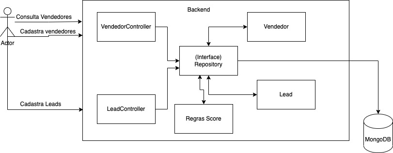

# Score

Projeto desenvolvido para o processo seletivo da winSocial

Para executar localmente

```sh
npm install
npm run run:dev
```

Executando em produção

```sh
npm install
npm run build
npm start
```

## Arquitetura
Arquitetura utilizada foi o MVP, seguindo os padrões da orientação à objeto.




## Endpoints

| Methods | path      | body                                                            | Descrição                                              |
| ------- | --------- | --------------------------------------------------------------- | ------------------------------------------------------ |
| GET     | /vendedor | -                                                               | Endpoint para recuperação dos vendedores com seu score |
| POST    | /vendedor | { "nome": "string", "nivel_senioridade": "junior/pleno/senior"} | Endpoint para cadastro de vendedores                   |
| POST    | /lead     | { "nome": "string", "telefone": "string"}                       | Endpoint para cadastrar os Leads                       |


Nota: o Lead só pode ser cadastrado dia de semana e dentro do horário de trabalho. Ao cadastrar o lead, logo ele será atendido.


O Arquivo .env será enviado por email.

